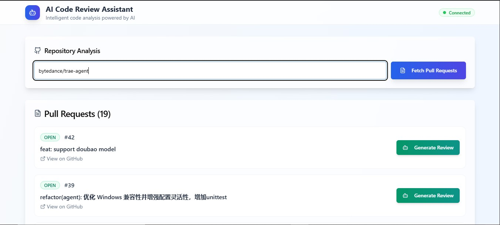
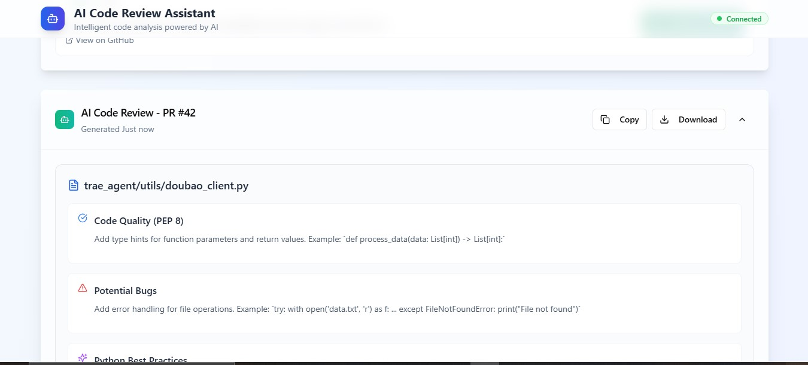

# AI Code Review Assistant

This project provides an AI-powered code review assistant with a web-based user interface. It consists of a Node.js/Express backend, a React frontend, and a Python AI agent that generates code reviews.

## Features

- Fetch Pull Requests from a specified GitHub repository.
- Generate AI-powered code reviews for individual Pull Requests.
- Display generated reviews in a structured, readable format.
- Save generated reviews to local files.

### Screenshots

#### Home Page



#### Review Section



## Project Structure

- `client/`: Contains the React frontend application.
- `server/`: Contains the Node.js/Express backend API.
- `ai-code-review-assistant/`: Contains the Python AI agent responsible for generating code reviews.
- `shared/`: Contains shared TypeScript types and schemas.
- `n8n_workflows/`: Contains n8n workflow JSON files for PR detection and listing.

## Getting Started

Follow these steps to set up and run the project on your local machine.

### Prerequisites

Before you begin, ensure you have the following installed:

-   **Node.js** (LTS version recommended)
-   **npm** (comes with Node.js)
-   **Python 3.8+**
-   **pip** (comes with Python)
-   **Git**
-   **Docker** (for running n8n)

### 1. Clone the Repository

```bash
git clone https://github.com/your-repo/AI-Code-Reviewer.git
cd AI-Code-Reviewer
```

### 2. Install Dependencies

Install Node.js dependencies for the client and server:

```bash
npm install
```

Install Python dependencies for the AI agent:

```bash
pip install -r ai-code-review-assistant/requirements.txt
```

### 3. Configuration

#### Environment Variables (`.env` file)

Create a `.env` file in the root directory of the project (`AI-Code-Reviewer/.env`) and add the following variables:

```
GITHUB_TOKEN=your_github_personal_access_token
TOGETHER_AI_API_KEY=your_together_ai_api_key
```

-   **`GITHUB_TOKEN`**: A GitHub Personal Access Token is required to fetch file contents from pull requests. Create a token with `repo` scope (or `public_repo` if your repositories are public).
    1.  Go to [GitHub Developer Settings](https://github.com/settings/tokens).
    2.  Click `Generate new token` (or `Generate new token (classic)`).
    3.  Give it a descriptive name (e.g., `AI Code Reviewer`).
    4.  Select the `repo` scope (or `public_repo` for public repos).
    5.  Click `Generate token` and copy the token.

-   **`TOGETHER_AI_API_KEY`**: The AI agent uses Together AI for generating code reviews. Obtain an API key from [Together AI](https://www.together.ai/).

#### n8n Workflows

This project relies on n8n workflows to fetch pull request data. n8n should be running locally on `http://localhost:5678`.

1.  **Run n8n with Docker:**
    ```bash
    docker run -it --rm --name n8n -p 5678:5678 -v ~/.n8n:/home/node/.n8n n8nio/n8n
    ```
    This command starts n8n and maps port 5678. Your n8n data will be persisted in `~/.n8n`.

2.  **Import Workflows:**
    *   Open your browser and navigate to `http://localhost:5678`.
    *   In the n8n UI, go to `Workflows`.
    *   Click `New` -> `Import from JSON`.
    *   Import the `PR_Detection.json` and `List_PRs.json` files located in the `n8n_workflows/` directory of this project.
    *   **Activate both workflows** by toggling the `Active` switch for each.

### 4. Running the Application

To start both the Node.js backend/frontend and the Python AI agent with a single command, run:

```bash
npm run start:all
```

This command uses `concurrently` to:

-   Start the Node.js server and React development server (`npm run dev`).
-   Start the Python AI agent (`python ai-code-review-assistant/src/ai_review_agent.py`).

Once all services are running, open your web browser and navigate to `http://localhost:5173` (or the port indicated by the React development server).

### 5. Generating Reviews

1.  In the web UI, enter a GitHub repository name (e.g., `octocat/Spoon-Knife`).
2.  Click "Fetch Pull Requests".
3.  Select a PR and click "Generate Review".

The generated review will appear in the UI, be printed to your server's terminal, and saved as `review_PR_NUMBER.txt` in the `ai-code-review-assistant/src/` directory.

## Development

### Backend (Node.js/Express)

-   **Start Development Server:** `npm run dev`
-   **Build for Production:** `npm run build`
-   **Start Production Server:** `npm run start`

### Frontend (React)

The React development server is started as part of `npm run dev`.

### AI Agent (Python)

-   **Run:** `python ai-code-review-assistant/src/ai_review_agent.py`

## Troubleshooting

-   **`n8n webhook not active` or `Cannot connect to n8n service`:** Ensure your n8n instance is running via Docker on `http://localhost:5678` and both `PR_Detection` and `List_PRs` workflows are imported and activated in the n8n UI.
-   **`Failed to fetch PRs`:** Check your internet connection, the GitHub repository name, and ensure your n8n workflows are correctly configured and active.
-   **`Failed to trigger review`:** Ensure your `GITHUB_TOKEN` and `TOGETHER_AI_API_KEY` are correctly set in your `.env` file.

## Contributing

Feel free to contribute to this project by submitting issues or pull requests.

## License

This project is licensed under the MIT License. See the `LICENSE` file for details.
